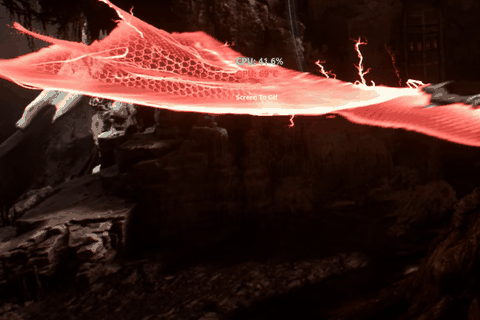

# Lightware Monitor

> **Lightware Monitor** is a lightweight, always-on-top hardware monitoring overlay for Windows gamers.

---

## Features

- **Real-time telemetry** — CPU usage (%), GPU temperature (°C), and FPS sampled every ~100ms
- **Always-on-top overlay** — stays visible over fullscreen games and applications
- **Click-through mode** — overlay ignores mouse input by default so it never steals focus from your game
- **4 built-in themes** — Cyberpunk Neon, Stealth White, Crimson Fury, Aurora Green
- **Mini mode** — compact bar; toggle with double-click or tray menu
- **Resizable normal mode** — drag any corner to scale the overlay; text auto-fits
- **Tray icon** — right-click for themes, mode switching, reset, and auto-start options
- **Persisted settings** — position, size, theme, and mode survive restarts
- **No dependencies** — self-contained .NET 9 build, no runtime installation required

---

## Screenshots

### Demo — In-game overlay

_The Lightware Monitor overlay running over a game — real-time CPU, GPU, and FPS at a glance._

### Built-in themes

---

## Premium — $4.99

Unlock **Custom Themes** — create and save unlimited custom color themes:

- Adjustable RGB values for every metric (CPU, GPU, FPS, game name)
- Save unlimited custom presets
- One-click theme switching via tray menu

**[Get Premium →]()**

---

## Quick Start

1. Extract `LightwareMonitor-Portable-v1.0.0.zip` anywhere
2. Run `LightwareMonitor.UI.exe`
3. The overlay appears at the top-left of your primary monitor
4. Hold **Left Ctrl + Left Shift** to unlock the overlay (enables dragging, resizing, close button)
5. Right-click the **tray icon** to switch themes, toggle mini mode, or reset settings

### Keyboard Shortcuts

| Action | How |
|---|---|
| Unlock overlay | Hold `Left Ctrl` + `Left Shift` |
| Toggle mini mode | Double-click the overlay (when unlocked) |

---

## System Requirements

| | |
|---|---|
| **OS** | Windows 10 (1809+) or Windows 11 |
| **Architecture** | x64 |
| **Dependencies** | None (self-contained) |
| **Admin rights** | Not required |

---

## Privacy

Lightware Monitor **does not collect any data**. It runs entirely locally. No telemetry, no analytics, no network requests.

---

## License

This is a proprietary, closed-source application. See [LICENSE](LICENSE) for the full
end user license agreement (EULA). The premium features are licensed separately
under a commercial license — see [PREMIUM.md](PREMIUM.md).

---

## Support

For issues or questions, open an issue on this repository.
